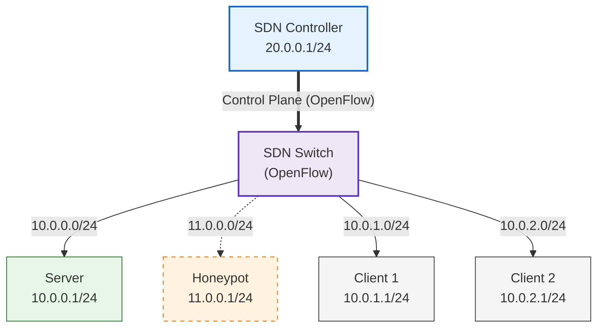

# SDN-Based Honeypot

This project was developed as part of the _"Next Generation Network"_ course. It implements a **security honeypot** architecture based on **Software-Defined Networking (SDN)** over a Kathará-emulated enterprise network.

The scenario model a company environment composed of:
- a legitimate server exposing HTTP services
- a honeypot that mimics the server
- hosts representing both authorized and unauthorized users

The SDN controller dynamically identifies untrusted access attempts and, instead of blocking the source IP, leverages SDN capabilities to transparently redirect malicious hosts to the honeypot.
Thanks to packet manipulation at the network layer, the malicious host remains unaware of the redirection.

---

## Project description
The project consists of an active laboratory environment in which the network of a fictitious company, HoneyMoon INC., is deployed using Kathará. Clients can interact with the infrastructure by accessing services hosted within the network.
The architecture follows a client–server model, with traffic fully managed by an SDN-enabled switch under the control of a centralized controller.

### Network Topology

The network is composed of five hosts, each belonging to a different subnet, interconnected through an Open vSwitch and managed by an SDN controller (Ryu).



### Trust Model

Not all the subnets in the company have the same privileges:
- Trusted subnet: `10.0.1.0/24` --> `Client 1`
- Untrusted subnet: `10.0.2.0/24` --> `Client 2`

The server exposes an HTTP service that includes an admin-only area containing private information.
Hosts belonging to trusted networks are allowed to access such resources, whereas traffic originating from untrusted networks is closely monitored.

### SDN Control Logic

All packets flow through the SDN switch which operates under the control of the Ryu controller, acting as the logical brain of the network. The controller
1. Handles incoming packets according to SDN principles
2. Implements routing functions for inter-network communication
3. Installs flow rules on the switch using `FLOW_MOD` messages for subsequent packets.

The controller follows a self-learning approach: it is initially aware only of the involved subnets (defined in `NETCONFIG.py` file) while output ports and IP-to-MAC associations are dynamically learned during operation.

### HoneyPot implementation

The honeypot is deployed as a separate host within the network and runs a service that closely replicates the behavior of the legitimate server, while providing fake and non-sensitive information. Its purpose is to deceive malicious users by offering an environment that appears genuine, thereby allowing their activity to be observed without exposing real assets.

Once the SDN controller has learned the network topology, it continuously monitors traffic originating from untrusted subnets. When packets contain application-layer payloads, the controller performs **Deep Packet Inspection (DPI)** to detect attempts to access protected resources. Upon identifying a suspicious or unauthorized access attempt, the controller exploits SDN capabilities to transparently redirect the traffic toward the honeypot.

This redirection is achieved by installing flow rules on the switch that dynamically modifying packet's L3-headers, ensuring that the malicious client remains unaware of the redirection. From the attacker’s perspective, the communication continues normally, while in reality it is being handled by the honeypot. This approach allows the system to both protect the legitimate server and gather valuable information about malicious behavior.

---

## Repository Structure

```bash
main
├── build.sh
├── Dockerfiles
│   ├── Dockerfile.host
│   ├── Dockerfile.ryu
│   └── Dockerfile.server
├── Kathara
│   ├── controller.shutdown
│   ├── controller.startup
│   ├── h1.startup
│   ├── h2.startup
│   ├── honeypot.startup
│   ├── lab.conf
│   ├── s1.startup
│   ├── server.startup
│   └── shared
│       ├── controllerSDN
│       │   ├── controller.py
│       │   ├── customLogger.py
│       │   └── NETCONFIG.py      
│       └── scripts
│           └── init.sh
├── LICENSE
├── README.md
└── Services
    ├── HttpController
    │   ├── app.py
    │   ├── static
    │   └── templates
    ├── HttpHpot
    │   ├── app.py
    │   └── templates
    └── HttpServer
        ├── app.py
        └── templates
```

- `/Dockerfiles`: contains containers images for the controller, servers and hosts
- `/Kathara`: contains the Kathara's configuration files and che shared scripts
- `/Services`: containts the HTTP Services of each vitual machine
---

## Usage

### Requirements
- Kathara

### Project setup

1. Clone or download the repository the repository and navigate into it
```bash
git clone `<url>`
cd SDN-based_honeypot/
```

2. Launch the `build.sh` script in order to build the Docker images deployed in the lab
```bash
./build.sh
```

### Project launch

Navigate to the `Kathara` folder and start the lab.

```bash
cd Kathara/
kathara lstart
```
Kathara will automatically deploy the VMs three terminals will appear, one for Host1 (`h1`), one for Host2 (`h2`) and one for the Honeypoy.

Notice that kathara uses xTerm by default, I highly suggest to change the terminal emulator to a more confortable one. To launch Kathara with a custom terminal use the `--terminal-emu` flag fllowed by the <path to terminal> e.g.:

```bash
kathara lstart --terminal-emu /usr/bin/gnome-terminal
```

### The Lab

Open your browser and navigate to the `controller` dashboard by digiting the url `http://localhost:8080/dahsboard`. The web app for the controller shoudl appear. You can navigate through the three sections:

1. Home: contains the server and honeypot status
2. Console: propose the controller terminal
3. Devices: show the devices connected to the switch

You may notice that it's quite empty, that's beacause the SDN controller is not running. Go to the Home page and click on the green `Launch Controller` button.
Console and devices should start to populate and status should go on "on". Wait until the VMs are properly started.
